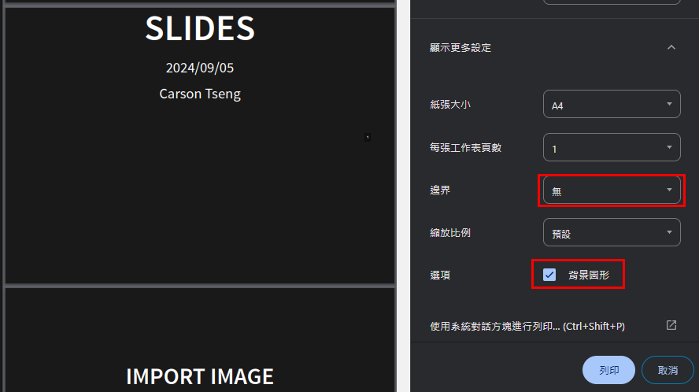

## 查看你的幻燈片清單

> 👉 [/{{.MDName}}](/{{.MDName}})

## USAGE

1. (Optional)在你的工作目錄新增[slides.gohtml](https://github.com/CarsonSlovoka/slides/blob/master/slides.gohtml)，你可以適當的修改
2. [{{.MDName}}](https://github.com/CarsonSlovoka/slides/tree/master/md)目錄之中可以放想要投影的投影片內容
3. 啟動`slides.exe`
4. 訪問連結 `/{{.MDName}}/<位於md資料夾的md檔案名稱>`
    - example: [demo](/{{.MDName}}/example.md)

> 有關於example.md的內容，可以[至此下載](https://github.com/CarsonSlovoka/slides/blob/master/md/example.md)後存放到md的目錄之中

## 可選項:

所有的可選項透過GET.query的參數設定，你可以將多個可選項用`&`組合起來

> demo: [{{.MDName}}/example.md?theme=sky&autoSlide=5000](/{{.MDName}}/example.md?theme=sky&autoSlide=5000)

### 下載成pdf

請於網址最後面補上`?print-pdf`，在使用列印(<kbd>Ctrl+P</kbd>)即可

```
?print-pdf
```

> demo: [{{.MDName}}/example.md?print-pdf](/{{.MDName}}/example.md?print-pdf)

❗ 列印的時候，請選擇 `更多設定`，調整如下: (否則有的版面會很奇怪)

```
邊界: 無
- [ ] 頁首及頁尾  # 僅在邊界不為`無`才會出現
- [x] 背景圖形
```




### View

> demo: [{{.MDName}}/example.md?view=scroll](/{{.MDName}}/example.md?view=scroll)

### 變更主題顏色

theme=[?](https://github.com/hakimel/reveal.js/tree/472535065c7525abf0cc9df51c66f19fd2d2204f/dist/theme)

> demo: [{{.MDName}}/example.md?theme=sky](/{{.MDName}}/example.md?theme=sky)

### autoSlide

`?autoSlide=<毫秒>`

按下快捷鍵<kbd>A</kbd>可以Toggle

> demo: [{{.MDName}}/example.md?autoSlide=5000](/{{.MDName}}/example.md?autoSlide=5000)
